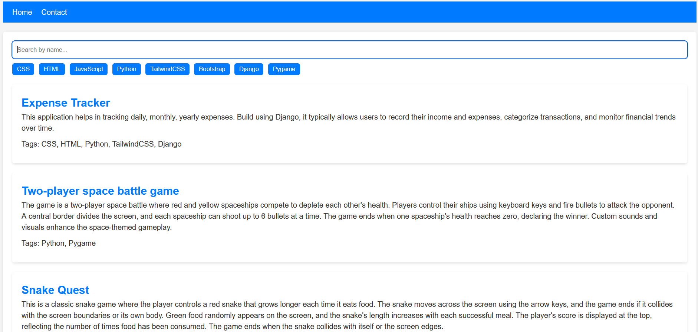
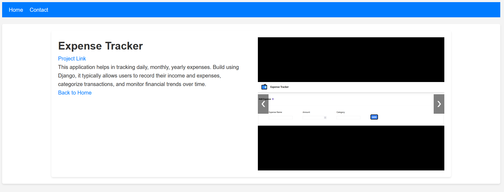

# Portfolio Website

This is my personal Portfolio Website where I showcase my projects, skills, and professional experience. It is built using Django, HTML, CSS, and JavaScript to create a modern, responsive design with a clean layout to effectively present my work.

## Features:

About Me: A brief introduction to who I am, my background, and my career goals.
Projects: Displays my completed projects, including descriptions, images, and links to GitHub 

## repositories:

Skills: A section highlighting my technical skills, programming languages, and frameworks I use.
Contact: Provides options to connect with me via social media or email.

## Technologies Used:

HTML5: For content structure.
CSS3: For styling and responsive layout design.
JavaScript: For adding interactive elements.
Django: (If used for backend)
AWS EC2: The site is deployed using an AWS EC2 instance.

## Screenshots:

### Home Page
 

### Projects Section
 
